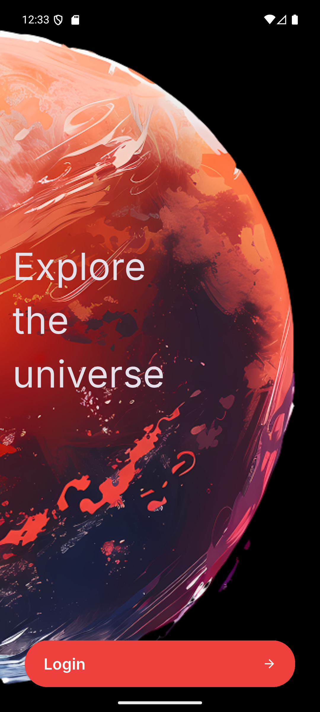
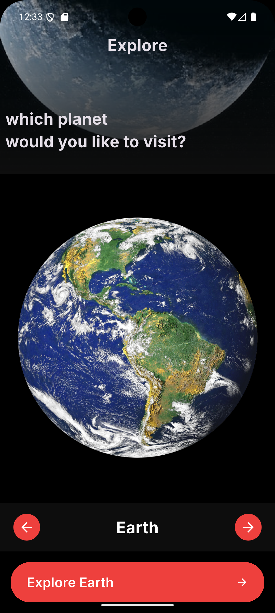
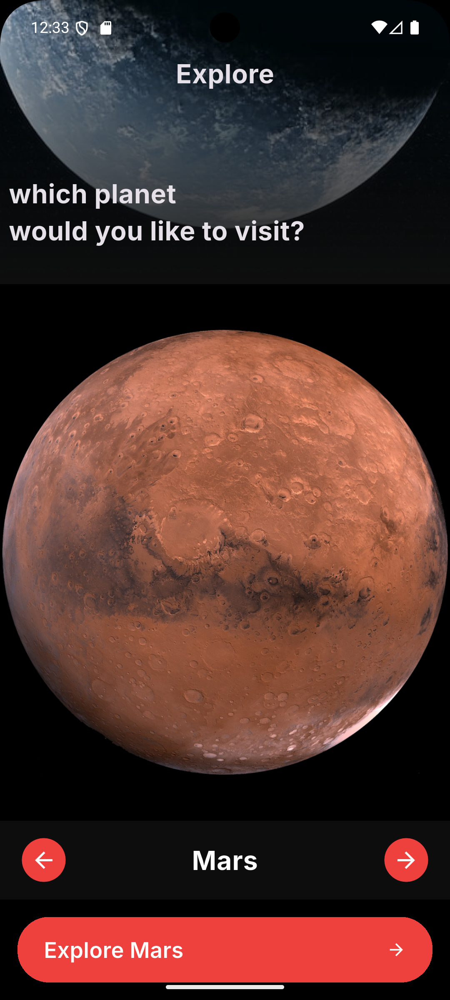
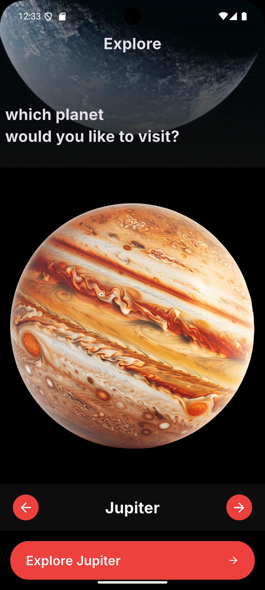
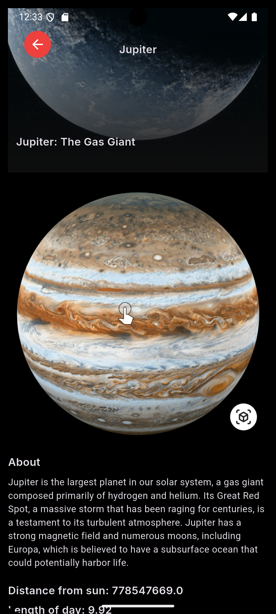

# 🚀 Space App

## 📌 Overview

**Space App** is a Flutter application that showcases detailed information about the solar system, including the Sun and all planets.
The app provides rich scientific data, images, and an interactive experience for exploring space.

---

## ✨ Features

* 🌞 Display the Sun and all planets in the solar system
* 📊 Detailed information for each planet:

  * Name
  * Description
  * Distance from the Sun
  * Length of Day
  * Orbital Period
  * Radius
  * Mass
  * Gravity
  * Surface Area
* 🖼️ High-quality planet images
* 🧊 3D models support (`.glb`) for interactive visualization
* ⚡ Smooth and responsive UI
* 📱 Clean architecture and scalable code

---

## 🧠 Data Model

The app uses a structured model called `PlanetModel`:

```dart
class PlanetModel {
  final String? planetName;
  final String? pngImage;
  final String? threeDModel;
  final String? title;
  final String? about;
  final double? distanceFromSun;
  final double? lengthOfDay;
  final double? orbitalPeriod;
  final double? radius;
  final String? mass;
  final double? gravity;
  final String? surfaceArea;
}
```

### 📦 Included Data

The app contains a static list of planets:

* Sun
* Mercury
* Venus
* Earth
* Mars
* Jupiter
* Saturn
* Uranus
* Neptune

Each object includes full scientific and descriptive data.


## 🔮 Future Improvements

* 🎮 Full 3D interaction

---

## 📸 Screenshots








---

## 🤝 Contributing

Pull requests are welcome. For major changes, please open an issue first.


---

## 👨‍💻 Developer

Developed using Flutter with Mohamed Shaaban❤️
